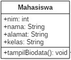
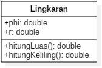
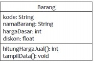

# **Jobsheet 02 Class dan Object**
1. # **Percobaan**
   1. **Percobaan 1: Membuat Class Diagram**

Studi Kasus 1:

Dalam suatu perusahaan salah satu data yang diolah adalah data karyawan. Setiap karyawan memiliki id, nama, jenis kelamin, jabatan, jabatan, dan gaji. Setiap mahasiswa juga bisa menampilkan data diri pribadi dan melihat gajinya.

1. Gambarkan desain class diagram dari studi kasus 1!,

1. Sebutkan Class apa saja yang bisa dibuat dari studi kasus 1!,

Class perusahaan dan class karyawan

1. Sebutkan atribut beserta tipe datanya yang dapat diidentifikasi dari masing-masing class dari studi kasus 1!

+karyawan: Karyawan	+ id: int	+ nama: String		+ gender: char

+jabatan: String		+ gaji: int 

1. Sebutkan method-method yang sudah anda buat dari masing-masing class pada studi kasus 1!

+tampilKaryawan();	+tambahKaryawan();	+tampilData();		+tampilGaji();
#
#
#
1. # **Percobaan 2: Membuat dan mengakses anggota suatu class**
Studi Kasus 2:

Perhatikan class diagram dibawah ini. Buatlah program berdasarkan class diagram tersebut!

Langkah kerja:

1. Bukalah text editor atau IDE, misalnya Notepad ++ / netbeans.
1. Ketikkan kode program berikut ini:

1. Simpan dengan nama file Mahasiswa.java.
1. Untuk dapat mengakses anggota-anggota dari suatu obyek, maka harus dibuat instance dari class tersebut terlebih dahulu. Berikut ini adalah cara pengaksesan anggota- anggota dari class Mahasiswa dengan membuka file baru kemudian ketikkan kode program berikut:

1. Simpan file dengan TestMahasiswa.java
1. Jalankan class TestMahasiswa
1. Jelaskan pada bagian mana proses pendeklarasian atribut pada program diatas!

Pada class mahasiswa

1. Jelaskan pada bagian mana proses pendeklarasian method pada program diatas!

Pada class mahasiswa 

1. Berapa banyak objek yang di instansiasi pada program diatas!

Satu objek, objek Mahasiswa

1. Apakah yang sebenarnya dilakukan pada sintaks program “mhs1.nim=101” ?

Menginput data nim dari objek mahasiswa

1. Apakah yang sebenarnya dilakukan pada sintaks program “mhs1.tampilBiodata()” ?

Memanggil method tampilBiodata(); pada class Mahasiswa

1. Instansiasi 2 objek lagi pada program diatas!

1. # **Percobaan 3: Menulis method yang memiliki argument/parameter dan memiliki return**
Langkah kerja:

1. Bukalah text editor atau IDE, misalnya Notepad ++ / netbeans.
1. Ketikkan kode program berikut ini

1. Simpan dengan nama file Barang.java
1. Untuk dapat mengakses anggota-anggota dari suatu obyek, maka harus dibuat instance dari class tersebut terlebih dahulu. Berikut ini adalah cara pengaksesan anggota- anggota dari class Barang dengan membuka file baru kemudian ketikkan kode program berikut:

1. Simpan dengan nama file TestBarang.java
1. Jalankan program tersebut!

1. Apakah fungsi argumen dalam suatu method?

Agar sebuah method dapat menerima input data

1. Ambil kesimpulan tentang kegunaan dari kata kunci return , dan kapan suatu method harus memiliki return! Return mengembalikan nilai sebuah variabel, sebuah method menggunakan return ketika ada nilai yang ingin didapatkan dari pemanggilan method

1. # **Tugas**
   1. Suatu toko persewaan video game salah satu yang diolah adalah peminjaman, dimana data yang dicatat ketika ada orang yang melakukan peminjaman adalah id, nama member, nama game, dan harga yang harus dibayar. Setiap peminjaman bisa menampilkan data hasil peminjaman dan harga yang harus dibayar. Buatlah class diagram pada studi kasus diatas!

Penjelasan:

0. Harga yang harus dibayar diperoleh dari lama sewa x harga.
0. Diasumsikan 1x transaksi peminjaman game yang dipinjam hanya 1 game saja.

1. Buatlah program dari class diagram yang sudah anda buat di no 1!

1. Buatlah program sesuai dengan class diagram berikut ini:

1. Buatlah program sesuai dengan class diagram berikut ini:

Deskripsi / Penjelasan :

0. Nilai atribut hargaDasar dalam Rupiah dan atribut diskon dalam %
0. Method hitungHargaJual() digunakan untuk menghitung harga jual dengan perhitungan berikut ini:
# **harga jual = harga dasar – (diskon x harga dasar)**

0. Method tampilData() digunakan untuk menampilkan nilai dari kode, namaBarang, hargaDasar, diskon dan harga jual.
