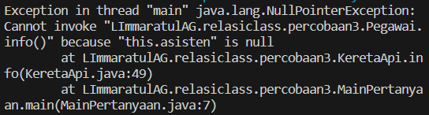
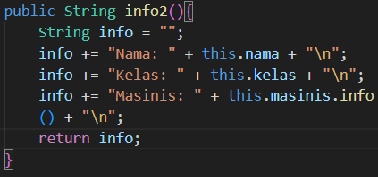
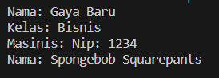

1. Di dalam method info() pada class KeretaApi, baris this.masinis.info() dan this.asisten.info() digunakan untuk apa ?
digunakan untuk memanggil data objek masinis dan asisten dari class pegawai
2. Buatlah main program baru dengan nama class MainPertanyaan pada package yang sama. Tambahkan kode berikut pada method main() !
Pegawai masinis = new Pegawai("1234", "Spongebob Squarepants");
KeretaApi keretaApi = new KeretaApi("Gaya Baru", "Bisnis", masinis);
System.out.println(keretaApi.info());
3. Apa hasil output dari main program tersebut ? Mengapa hal tersebut dapat terjadi ?

hal ini dikarenakan, method info yang dipanggil memerlukan nilai dari asisten, sedangkan objek asisten tidak ada
4. Perbaiki class KeretaApi sehingga program dapat berjalan !
cara memperbaikinya adalah dengan membuat method info yang tidak menggunakan objek asisten

Outputnya akan seperti ini
