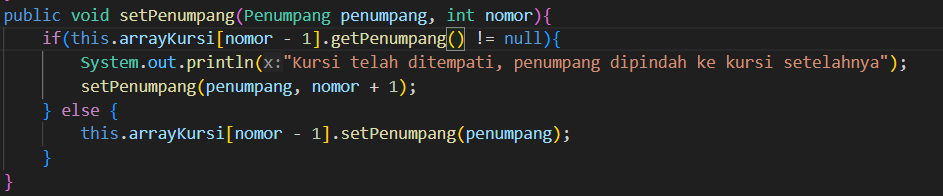

1. Pada main program dalam class MainPercobaan4, berapakah jumlah kursi dalam Gerbong A ?
gerbong A memiliki 10 kursi
2. Perhatikan potongan kode pada method info() dalam class Kursi. Apa maksud kode tersebut ?
...
if (this.penumpang != null) {
info += "Penumpang: " + penumpang.info() + "\n";
}
...
kode program tersebut digunakan untuk melihat apakah kursi(indeks) tersebut kosong atau tidak, dan jika kursi tidak kosong maka akan mengeluarkan identitas yang menduduki kursi
3. Mengapa pada method setPenumpang() dalam class Gerbong, nilai nomor dikurangi dengan angka 1 ?
hal tersebut karena bagian program tersebut berfungsi untuk mengisi indeks dari arraykursi yang dimana array dimulai dari indeks ke-0 sedangkan nomor kursi dimulai dari 1. sehingga nomor dikurangi 1 agar informasi masuk didalam indeks yang tepat
4. Instansiasi objek baru budi dengan tipe Penumpang, kemudian masukkan objek baru 
tersebut pada gerbong dengan gerbong.setPenumpang(budi, 1). Apakah yang terjadi ?
penumpang yang menduduki kursi itu sebelumnya (Mr. Krabs) digantikan oleh data penumpang yang baru
5. Modifikasi program sehingga tidak diperkenankan untuk menduduki kursi yang sudah ada penumpang lain !
