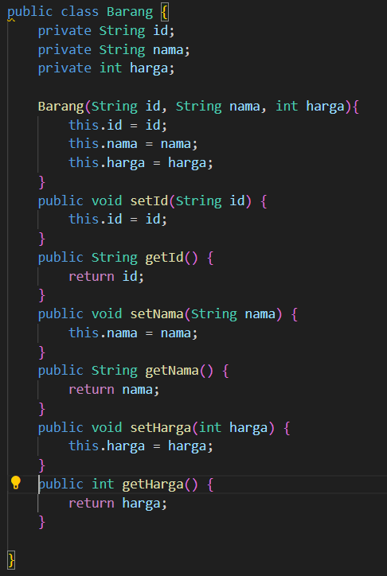

Quiz 1

Nama    : Lalu Immaratul Ardhi Ganeru
Kelas   : TI-2C
NIM     : 2241720169

1. Class dan Object:
Apa yang dimaksud dengan "class" dalam pemrograman berorientasi objek?
class dalam pemrograman adalah sebuah template untuk membuat objek

Bagaimana Anda mendefinisikan objek dari suatu class dalam bahasa pemrograman Java?
dengan membuat method yang memiliki nama yang sama dengan classobjek tersebut dan mendefinisikan tiap atributnya

Misalkan Anda memiliki class "Barang" dalam sistem informasi inventaris.Bagaimana Anda akan membuat objek "laptop" dari class tersebut?
dengan membuat objek baru laptop di kelas main seperti"Barang laptop = new Barang();"

2. Encapsulation:
Jelaskan konsep encapsulation dalam pemrograman berorientasi objek dan mengapa hal ini penting dalam pengembangan sistem informasi inventaris barang.
encapsulation adalah pengemasan atribut dengan metode yang bekerja dengan atribut tersebut dalama satu unit(class)

Dalam konteks sistem informasi inventaris, sebutkan contoh atribut (variabel) yang harus di-encapsulate dan mengapa.
Harga dan jumlah barang agar nilainya tidak mudah dirubah dan tanggal masuk barang untuk memastikan data yang tetap konsisten

3. Relasi Kelas:
Apa yang dimaksud dengan relasi antara kelas dalam pemrograman berorientasi objek?
relasi antar kelas adalah hubungan dari kelas-kelas dalam sebuah sistem yang dimana mereka bisa berbagi data dan fungsi untuk membentuk sebuah sistem.
Dalam sistem informasi inventaris barang, bagaimana Anda akan menggambarkan relasi antara kelas "Barang" dan kelas "Kategori"?
relasi antar kelas tersebut adalah many to one dimana banyak objek barang dapat termasuk dalam kategori yang sama
4. PBL:
Berdasarkan kasus sistem informasi inventaris barang, coba buat sebuah class sederhana beserta atribut dan metodenya yang menggambarkan suatu entitas dalam sistem tersebut (misalnya, class "Barang").

Bagaimana Anda akan menggunakan encapsulation untuk melindungi atribut-atribut dalam class tersebut?
dengan menggunakan status private untuk atribut-atributnya

Gambarkan hierarki class atau hubungan antar class yang mungkin ada dalam sistem informasi inventaris barang di jurusan Teknologi Informasi. Berikan contoh relasi antar class (misalnya, inheritance atau association) dalam konteks tersebut
Pembuatan class kategori yang digunakan untuk mengelompokkan objek barang. Relasi antar class ini adalah asociation dimana tiap barang memiliki satu jenis kategori.